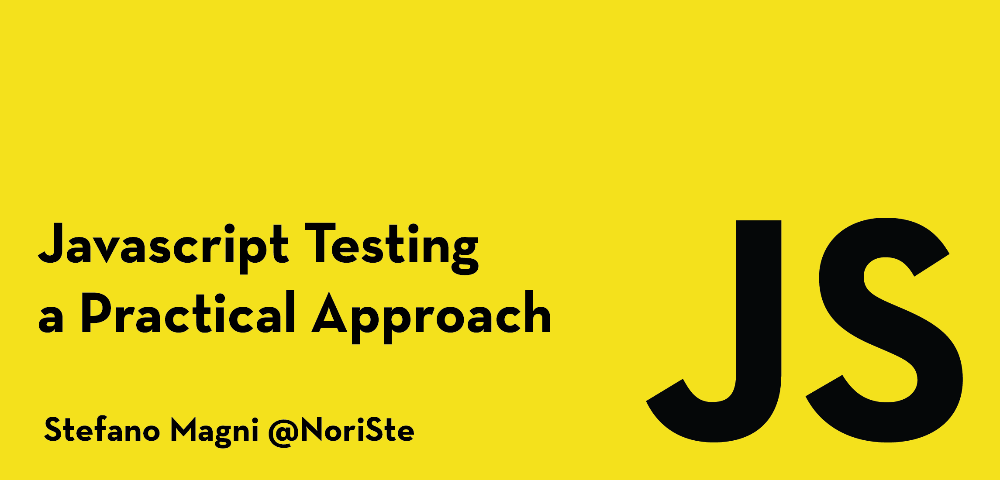

# Javascript Testing, a Practical Approach

## Description

This is the [reference repository](https://github.com/NoriSte/javascript-testing-practical-approach-2021-course-v4) with all the contents and the examples of the "Javascript Testing, a Practical Approach" course.

The course starts from the peak of the testing pyramid and goes down instead of following the "standard" testing path.

## During the course
The most important scripts are:
- `$ npm run realworld:frontend:start`: starts the front-end project

Then, one of the following
1. `$ npm run cy:open`: starts the Cypress UI
2. `$ npm run pw:e2e:ui`: starts the Playwright UI

## Table of contents

In the "docs" folder there are:
- The [Adding Playwright to an existing project](./docs/add-playwright.md) guide
- The [Adding Cypress to an existing project](./docs/add-cypress.md) guide
- The [Getting ready for the course](./docs/getting-ready.md) guide
- The list of [Resources](./docs/resources.md)

## About me

I'm Stefano Magni, I'm a passionate and positive-minded **Senior Front-end Engineer**, a Speaker, and an Instructor from Italy (working remotely since 2018). Developing User Interfaces, solving problems, and helping people are my passions.

I have worked in this field for more than ten years, including experience with different codebases (currently working on a 250K-LOC one) and various companies: a mid-size company, a Bitcoin startup, a web-agency, etc. organized through Scrum, Kanban, or classic Waterfall.

What I love:
- working with passionate people
- coding User Interfaces, solving the closest to the user problems
- writing maintainable and easy to refactor code
- guaranteeing the highest possible quality of my work with precise execution and problems prevention
- easing other developers and stakeholders work with high proactivity, communication, providing a lot of feedback, mentoring, and improving workflows
- actively looking for and proposing solutions for every kind of problem I see
- learning and solidifying/spreading my knowledge by speaking and teaching

In the last years, I became a speaker again, revamping my learning path completely, including answering on StackOverflow, writing articles, sharing plugins, and speaking at meetups.

I'm currently focused on React, TypeScript and all their ecosystems.

I wrote a big [UI Testing Best Practices](https://github.com/NoriSte/ui-testing-best-practices) project on GitHub.

[GitHub](https://github.com/NoriSte) - [LinkedIn](https://www.linkedin.com/in/noriste/) - [Twitter](https://twitter.com/NoriSte)

## Changes compared to the previous version of the course

- Support PlayWright
